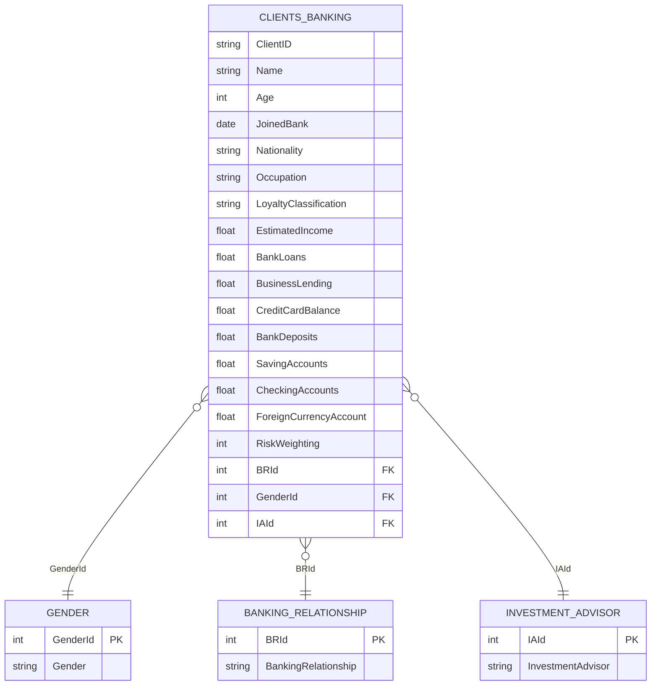
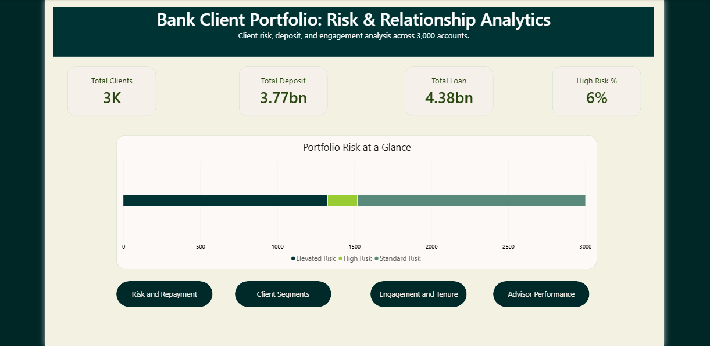
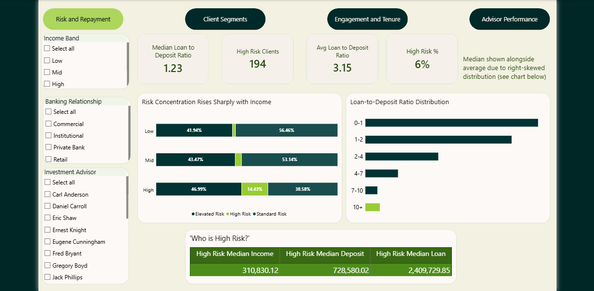
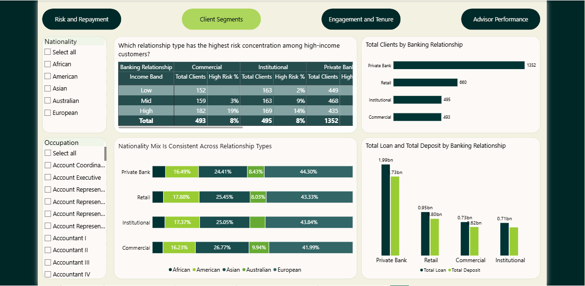
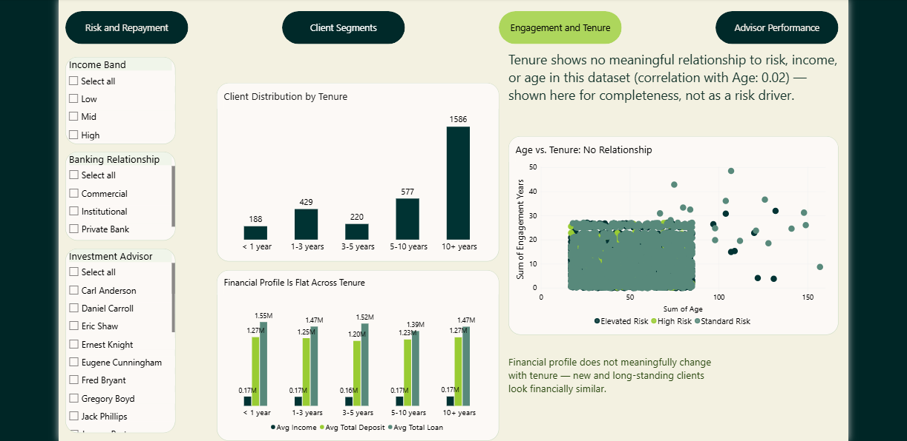

# Bank Client Portfolio: Risk & Relationship Analytics

Client risk, deposit, and engagement analysis across 3,000 accounts, built to help a bank's risk and relationship management teams identify where credit exposure is concentrated and which customer characteristics actually differentiate risk.

**Tools:** Python (pandas, NumPy, seaborn, matplotlib, SciPy) for exploratory analysis and statistical validation · Power BI for the interactive dashboard

📓 Full analysis notebook: [`Banking_Dashboard.ipynb`](./Banking_Dashboard.ipynb)
📊 Interactive dashboard: [`Bank_Client_Portfolio_by_Avnika_Nayee.pbix`](./Bank_Client_Portfolio_by_Avnika_Nayee.pbix)
📁 Source data: [`Banking.xlsx`](./Banking.xlsx)

---

## Background and Overview

The bank maintains a portfolio of 3,000 client accounts spanning four banking relationship types (Retail, Private Bank, Commercial, and Institutional), each managed by one of 22 investment advisors. Client risk is currently tracked through an internal **Risk Weighting** score (1–5), but this measure has not been systematically analyzed alongside client income, lending exposure, tenure, or advisor assignment.

This project analyzes the client portfolio to answer four questions for the risk and relationship management teams:

- What does the overall risk and financial profile of the portfolio look like?
- Which customer or account characteristics are actually associated with higher risk, and which ones just look like they should be but aren't?
- Is risk concentrated in any particular banking relationship, advisor, or customer segment?
- What data quality issues need to be resolved before this analysis could support production risk monitoring?

To answer these, the raw client data was cleaned and merged with three lookup tables, then explored using univariate and bivariate analysis, correlation analysis, and chi-square/Cramér's V tests for statistical validation. A derived **Risk Segment** (Standard / Elevated / High) was created by combining the existing Risk Weighting with a calculated Loan-to-Deposit Ratio, giving a more actionable exposure-based view than Risk Weighting alone.

The full data cleaning, feature engineering, and statistical methodology are documented in the [analysis notebook](./Banking_Dashboard.ipynb). This README summarizes the findings for a non-technical audience.

---

## Data Structure Overview

The dataset consists of one fact table (`Clients - Banking`) and three lookup tables, joined on ID columns:



Key columns used throughout the analysis:

| Category | Columns |
|---|---|
| Client demographics | Age, Nationality, Occupation, Gender, Joined Bank (tenure) |
| Income & lending | Estimated Income, Bank Loans, Business Lending, Credit Card Balance |
| Deposits | Bank Deposits, Saving Accounts, Checking Accounts, Foreign Currency Account |
| Relationship | Banking Relationship, Investment Advisor, Loyalty Classification |
| Risk | Risk Weighting (existing bank measure), Risk Segment (derived for this project) |

Two features were engineered specifically for this analysis: **Total Loan / Total Deposit** (sums of the relevant component accounts) and **Loan-to-Deposit Ratio (LDR)** — a standard banking exposure metric — which was then combined with Risk Weighting to produce the **Risk Segment** classification.

---

## Executive Summary

The portfolio carries **$4.38bn in total loans against $3.77bn in total deposits**, with a median client Loan-to-Deposit Ratio of 1.23 — meaning the typical client borrows about 23% more than they hold on deposit. **6% of clients (194 accounts) fall into the High Risk segment**, a classification built by combining the bank's existing Risk Weighting with LDR.

The single clearest driver of risk in this portfolio is **income**, not relationship type, tenure, or loyalty. High-income clients are roughly **7–14x more likely** to be High Risk than Low- or Mid-income clients, and this association held up under statistical testing. Banking relationship type, client tenure, and loyalty tier all showed little to no meaningful relationship with risk once income and lending exposure were accounted for.



---

## Insights Deep Dive

### 1. Risk & Repayment

- The median Loan-to-Deposit Ratio across the portfolio is **1.23**, but the distribution is heavily right-skewed (mean of 3.15), meaning a small group of clients carry loans many times larger than their deposits.
- Risk concentration rises sharply with income band: **High Risk clients rise from ~1–2% of Low- and Mid-income clients to ~14% of High-income clients.**
- The typical **High Risk client** has a median estimated income of **$310,830**, median deposits of **$728,580**, and median loans of **$2.41M** — a materially larger and more leveraged financial profile than the rest of the portfolio.



### 2. Client Segments

- **Private Bank** is the largest relationship segment (1,352 clients, 45% of the portfolio) and holds the largest loan and deposit book ($1.99bn loans / $1.73bn deposits), but its High Risk rate is **not** materially higher than Retail, Commercial, or Institutional clients.
- Nationality mix is consistent across all four relationship types, ruling it out as a segmentation driver for risk.
- This confirms a finding from the notebook's statistical testing: banking relationship type has limited practical association with the Risk Segment (low Cramér's V), even though Private Bank looks the most "exposed" on raw dollar totals.



### 3. Engagement & Tenure

- The portfolio skews long-tenured: **1,586 of 3,000 clients (53%)** have been with the bank for **10+ years**.
- Tenure shows almost no relationship with age (correlation of 0.02) or with financial profile — average income, deposits, and loans are essentially flat whether a client has been with the bank for under a year or over a decade.
- **Practical takeaway:** tenure is a useful segmentation filter for relationship management, but it is not a reliable risk signal on its own.



### 4. Advisor Performance

- The bank's 22 investment advisors manage a combined **$8.15bn** book, averaging **$370.47M per advisor**.
- Client counts and book sizes are nearly uniform across advisors (mostly 176–177 clients each, with a smaller subset around 88–89), consistent with a rotational rather than performance-based client assignment model.
- High Risk client counts should be read as a **rate**, not a raw count, since a handful of advisors carry smaller books by design.


---

## Recommendations

1. **Prioritize monitoring of high-income clients with elevated exposure.** High Risk status is concentrated among clients who combine high income with a high Loan-to-Deposit Ratio and elevated Risk Weighting — not high income alone. Monitoring should target the *combination* of these signals.
2. **Adopt Loan-to-Deposit Ratio as a standing exposure KPI**, reviewed alongside Risk Weighting rather than in isolation, to catch clients whose lending has outpaced their deposits.
3. **Make Income Band a primary filter in risk reporting.** It differentiates risk far more clearly than Banking Relationship or Tenure and should be given more prominence in the Power BI dashboard and management reporting.
4. **Don't equate Private Bank size with Private Bank risk.** Despite holding the largest book, Private Bank's High Risk rate is in line with other relationship types — exposure size and risk concentration are two different questions.
5. **Treat Tenure and Loyalty as relationship-management dimensions, not risk indicators**, given their limited statistical association with the Risk Segment.
6. **Resolve the duplicate Client ID issue before any production use.** 60 Client IDs are shared across different client records; a reliable unique identifier is needed before this analysis could support customer-level risk monitoring.

---

## Caveats and Assumptions

- **Synthetic data.** This dataset is synthetic, so relationships found here should be treated as findings specific to this dataset rather than evidence of real-world banking behavior.
- **No observed default outcome.** The data contains no actual loan default, delinquency, or repayment record, so this analysis identifies *associations* with existing risk measures — it does not predict probability of default.
- **Risk Segment thresholds are illustrative.** The High Risk classification (LDR > 1.5 and Risk Weighting ≥ 4) was defined for this project and is not a regulatory or bank-approved threshold.
- **Association ≠ causation.** The strong relationship between income and Risk Weighting is a statistical association, not proof that higher income causes higher risk.
- **Client ID is not a unique key.** 60 Client IDs are duplicated across different client records; row-level analysis was used throughout to avoid unreliable ID-based aggregation.
- **Loan-to-Deposit Ratio is heavily skewed**, with a maximum value of ~544. Medians and clipped visualizations were used to avoid distortion from a small number of extreme outliers.

---

## Repository Structure

```
├── README.md
├── Banking_Dashboard.ipynb        # Full EDA, feature engineering & statistical validation
├── Bank_Client_Portfolio_by_Avnika_Nayee.pbix   # Interactive Power BI dashboard
├── Banking.xlsx                   # Source data (fact table + lookup tables)
└── images/                        # Dashboard screenshots used in this README
```
